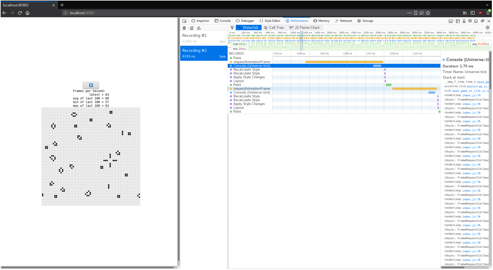

*commit/bb3451f035c1e2f6aaa440a87a63893c1d955390*

# 时间分析

这一描述了如何对Rust和WebAssembly的Web页面进行分析，目标是优化吞吐量或延迟。

> ⚡ 永远确保你在分析的时候使用的是优化的构建。`wasm-pack build`默认会使用优化构建。

## 可用的工具

### `window.performance.now()`计时器

[`performance.now()`函数][perf-now]返回一个从网页被加载以来的以毫秒为单位的单调时间戳。

调用`performance.now`几乎没有损耗，所以我们可以创建简单的力度测量，
而不会扭曲系统其余部分的性能并对测量造成偏差。

我们可以用它来给各种操作计时，可以通过[the `web-sys` crate][web-sys]来访问`window.performance.now()`：

```rust
extern crate web_sys;

fn now() -> f64 {
    web_sys::window()
        .expect("should have a Window")
        .performance()
        .expect("should have a Performance")
        .now()
}
```

* [The `web_sys::window` function](https://rustwasm.github.io/wasm-bindgen/api/web_sys/fn.window.html)
* [The `web_sys::Window::performance` method](https://rustwasm.github.io/wasm-bindgen/api/web_sys/struct.Window.html#method.performance)
* [The `web_sys::Performance::now` method](https://rustwasm.github.io/wasm-bindgen/api/web_sys/struct.Performance.html#method.now)

[perf-now]: https://developer.mozilla.org/en-US/docs/Web/API/Performance/now

### 开发者工具分析器

所有Web浏览的内奸开发者工具都包含一个分析器。这些分析器用常见的可视化类型，
如调用树和火焰图展示了哪个函数占据了最多的时间

如果你[使用带调试符构建][symbols]，那么“name”自定义部分被包含在wasm二进制文件中，
这些分析器应该能显示出Rust函数名而不是像`wasm-function[123]`这样的不透明内容。

注意，这些分析器*不会*显示内联函数，因为Rust和LLVM依赖于如此大量的内联，结果可能仍然有点令人困惑。

[symbols]: ./debugging.html#building-with-debug-symbols

[](../images/game-of-life/profiler-with-rust-names.png)

#### 资源

* [Firefox Developer Tools — Performance](https://developer.mozilla.org/en-US/docs/Tools/Performance)
* [Microsoft Edge Developer Tools — Performance](https://docs.microsoft.com/en-us/microsoft-edge/devtools-guide/performance)
* [Chrome DevTools JavaScript Profiler](https://developers.google.com/web/tools/chrome-devtools/rendering-tools/js-execution)

### `console.time`和`console.timeEnd`函数

[`console.time`和`console.timeEnd`函数][console-time]允许你
将命名操作的时间记录到浏览器的开发者工具控制台。
当操作开始的时候调用`console.time("some operation")`，
然后当它结束时调用`console.timeEnd("some operation")`。
字符串标签命名操作时可选的。

你可以通过[the `web-sys` crate][web-sys]直接使用这些函数：

* [`web_sys::console::time_with_label("some
  operation")`](https://rustwasm.github.io/wasm-bindgen/api/web_sys/console/fn.time_with_label.html)
* [`web_sys::console::time_end_with_label("some
  operation")`](https://rustwasm.github.io/wasm-bindgen/api/web_sys/console/fn.time_end_with_label.html)

这是一个在浏览器控制台的`console.time`记录的屏幕截图：

[](../images/game-of-life/console-time.png)

此外，`console.time`和`console.timeEnd`将显示出你浏览器分析器的“时间线”或“瀑布图”视图：

[](../images/game-of-life/console-time-in-profiler.png)

[console-time]: https://developer.mozilla.org/en-US/docs/Web/API/Console/time

### 对本地代码使用`#[bench]`

与我们通常书写`#[test]`来利用操作系统的本地代码调试工具而不用在Web上调试的方法一样，
我们可以通过编写 `#[bench]`来利用我们的操作系统本地代码分析工具。

在crate的`benches`子目录下编写基准测试。
确保你的`crate-type`包含了`"rlib"`，否则基准测试二进制文件将不能被连接到你的主要库。

不过，在投入大量精力在本地代码分析前，确保你知道瓶颈位于WebAssembly。
使用浏览器的分析器来确认这一点，否则你只是在浪费时间来优化冷代码。

#### 资源

* [Using the `perf` profiler on Linux](http://www.brendangregg.com/perf.html)
* [Using the Instruments.app profiler on macOS](https://help.apple.com/instruments/mac/current/)
* [The VTune profiler supports Windows and Linux](https://software.intel.com/en-us/vtune)

[web-sys]: https://rustwasm.github.io/wasm-bindgen/web-sys/index.html
